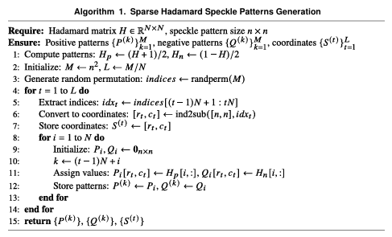
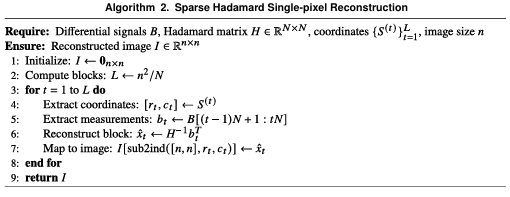
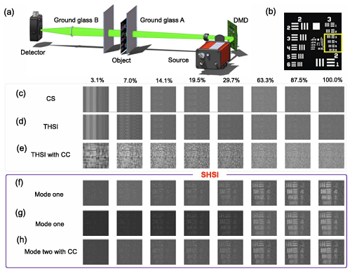

# Demonstration of Sparse Hadamard Single-Pixel Imaging Using the \( H_{64} \) Basis

## Overview

This repository presents a comprehensive framework for **Sparse Hadamard Single-Pixel Imaging (SHSI)** employing the \( H_{64} \) Hadamard basis. The implementation encompasses:

- Generation of randomized positive and negative sparse Hadamard speckle patterns derived from the \( H_{64} \) matrix.
- Simulation of single-pixel imaging data acquisition leveraging these speckle patterns.
- High-fidelity image reconstruction via the SHSI algorithm.
- Evaluation of noise robustness through additive white Gaussian noise (AWGN) simulations.
- Quantitative assessment of reconstruction quality using Peak Signal-to-Noise Ratio (PSNR) metrics.

## Repository Contents

- `Generate_hadamard_matrix_random_64_H.m`  
  Script to generate randomized sparse Hadamard speckle patterns based on the \( H_{64} \) matrix. The generated patterns are saved as PNG images, alongside the corresponding row and column indices necessary for SHSI reconstruction, following the procedure outlined in **Algorithm 1**:

  

- `Natural_Hadamard_Transform.m`  
  Function to generate Hadamard matrices of order \( 2^n \) via the Sylvester construction, producing matrices in natural order.

- `SHSI.m`  
  Main demonstration script that:
  - Loads the generated speckle patterns and associated indices.
  - Loads and preprocesses a test image (e.g., Cameraman).
  - Simulates single-pixel measurements using the speckle patterns.
  - Reconstructs the image via SHSI.
  - Demonstrates noise robustness by adding AWGN and compares noisy and noise-free reconstructions.
  - Computes and displays PSNR for quantitative evaluation.

  

## Usage Instructions

1. **Generate Hadamard Speckle Patterns**  
   Run `Generate_hadamard_matrix_random_64_H.m` to create and save the positive and negative sparse Hadamard speckle patterns based on the \( H_{64} \) basis. The patterns and indices for reconstruction will be saved under `./data/Random_Discrete_Hadamard_Postive_and_Negetive_matrix_64_H/`.

2. **Run the SHSI Reconstruction Demo**  
   Execute `SHSI.m` to simulate the single-pixel imaging acquisition and reconstruction process using the generated patterns.

## Experimental Results

(a-c) PSNR, SSIM, and RMSE of reconstruction results for DGI, ADMM-based CS, THSI, THSI combined with the CC, mode one using the \( H_{64} \) basis, mode two using the \( H_{64} \) basis, and mode two using the \( H_{64} \) basis combined with the CC at varying sampling rates under a 20 dB SNR condition.

## Contact

For inquiries or collaboration, please contact:

**Yuyuan Han**  
Email: hanyuyuan6@gmail.com